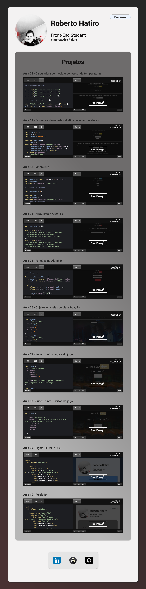
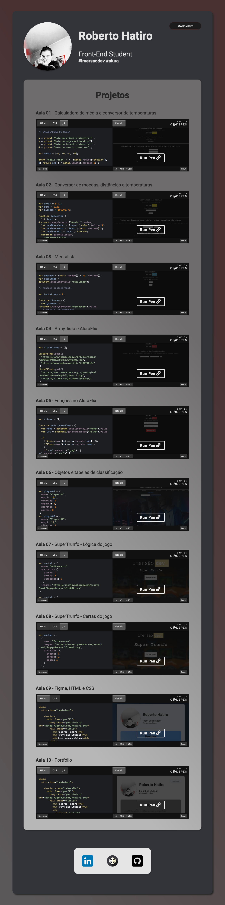

# Portfólio

### Screenshot

  
  

https://imersao.dev/aulas/aula10-portfolio

### Conteúdo detalhado desta aula:

- Utilizaremos o [Figma](https://www.figma.com/file/I4p9ndfOKgjDKalFwd5ASr/Imers%C3%A3o-Dev-Aula-10?node-id=0%3A1) para transformar o design em código;
- Estruturamos o nosso portfólio com HTML, aprendendo todas as tags necessárias pra isso;
- Estilizamos o nosso portfólio com CSS, conhecendo os seletores, propriedades e valores necessários para isso;
- Criamos o tema claro e escuro para o nosso portfólio;
- Fazemos a lógica em Javascript para alterar entre os temas.

A [Pen](https://codepen.io/rhatiro/pen/XWYGJgO) by [rhatiro](https://codepen.io/rhatiro) on [CodePen](https://codepen.io).

[License](https://codepen.io/license/pen/XWYGJgO).
